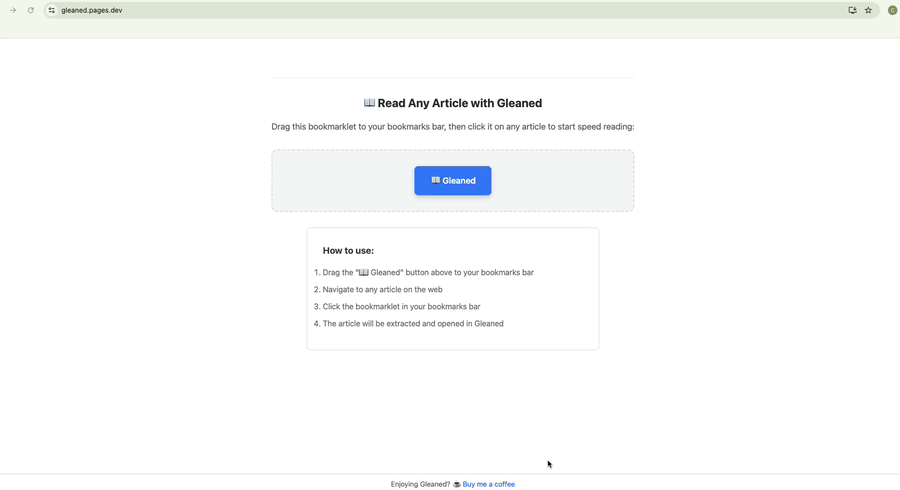

# Readme

## Overview

This is an RSVP speed reading app. Importantly, it's an open source progressive web app. This means no installation, you simply visit the webpage and that's it. The app lives inside your browser, you never have to sign up and your data is always yours.

If you find this project useful, consider a small donation to keep the lights on.

☕ *[Buy me a coffee](https://buymeacoffee.com/cog32)*

## Installation

Simply visit the page, [Gleaned](https://gleaned.pages.dev/) to try it out! No Apps, installs or signups.

## Usage

Find an article to read, then click your bookmarklet.

## Credits

Like a lot of open source, this project stands on the shoulders of giants. We are grateful to the maintainers and contributors of these projects:

- Mozilla Readability — article parsing and extraction <https://github.com/mozilla/readability>
- Lucide Icons — icon set used in the UI <https://lucide.dev>
- Vite — lightning‑fast dev server and build tool <https://vitejs.dev>
- Express + body-parser — lightweight dev API for bookmarklet ingestion <https://expressjs.com>, <https://github.com/expressjs/body-parser>

All trademarks are the property of their respective owners.
